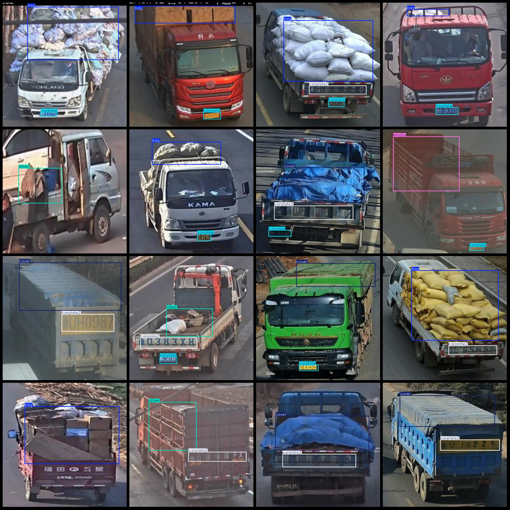
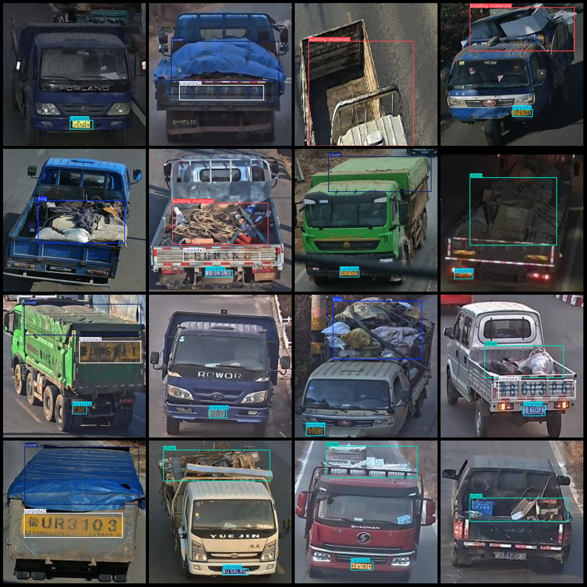

# Smart Transport Truck Cargo Status Full and Empty Truck License Plate Sandbag Bags Building Materials Detection Dataset VOC+YOLO Format 696 Images 8 Categories

Dataset format: Pascal VOC format + YOLO format (without split path in the txt file, only containing jpg images along with corresponding VOC format xml files and YOLO format txt files).

Number of images (jpg file count): 696
Number of annotations (xml file count): 696
Number of annotations (txt file count): 696
Number of annotation categories: 8
Annotation category names (notice that the order of categories in the YOLO format doesn't match this, but is based on the labels folder classes.txt): ["bag", "building materials", "carplate", 
"carplate2", "cover", "empty", "other", "sandy soil"]
Each category has a number of bounding boxes:
- Bag (bag) = 161
- Building materials (building materials) = 30
- Carplate (license plate) = 463
- Carplate2 (license plate 2) = 303
- Cover (cover) = 191
- Empty (empty) = 111
- Other (other) = 116
- Sandy soil (sandy soil) = 27
Total bounding boxes: 1402
Image resolution: 640x640
Used labeling tool: labelImg
Labeling rules: draw a bounding box around each category
Important note: No specific statement provided.
Special declaration: This dataset does not guarantee the accuracy of trained models or weight files.
Image preview:

## Images

Here is a pay link on Stripe ( https://buy.stripe.com/3cs8yP7sY87d0vu9AB ). Please contact me lonlonago@foxmail.com after funding $89, and I will send you a complete data files , thank you!

